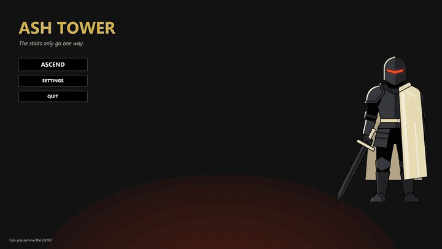

# Ash Tower

A totally original deckbuilding roguelike.

Someone once told me you aren't a real game developer until you've made a roguelike deckbuilder. Tell me if you can guess the inspiration.

You are the Cinder Knight. Climb the tower, collect cards and relics, and fight your way to the final boss.

## Play

[Download for Windows](https://github.com/debsamanta5571-dot/ash-tower/releases/download/v0.1/AshTower-Windows.zip)

Unzip and run `AshTower.exe`.

## Gameplay Features

- Card combat with intent, block, status, and relic hooks
- Procedural climb with a map
- Shop, rest, and reward screens

## What’s in the game

- 54 cards
- 9 enemies
- 29 relics
- 10 potions
- 6 events

## Technical Mechanics

### Deckbuilding

Cards live in a catalog. Each one is a pile of numbers (cost, damage, block, targeting) and, if it needs something special, a short extra effect. Upgrade flags and temporary discounts sit on the copy you actually play, so the catalog itself does not get rewritten mid-run.

The run holds your real deck. A fight clones it into draw, hand, discard, and exhaust. Every play goes through the same steps. Pay energy, apply the numbers, then run the extra effect if there is one. Rest, shop, and events only change the run deck. A new card is a new catalog row, not a new combat class.

### Energy

Energy exists only during a fight. You get a fresh pool at the start of your turn. One function decides what a card costs, so relics, statuses, spend-all cards, and free plays cannot disagree. You spend when you play. Whatever you do not spend stays until the turn ends. Relics that care about leftover energy can read that remainder without inventing a second resource.

### Relics

Relics are not a giant switch statement inside combat. Each one can hook a moment (fight start, turn start, turn end, a card being played, losing HP, shuffling, picking the relic up, or leaving a fight). Combat just calls those moments. A new relic is another catalog entry and a function that runs at the right time. You can only hold one of each, so the same relic cannot stack by accident.

### Combat

One rules engine runs the fight. Enemies pick a move and show an intent, so the UI is reading the next action, not guessing. All damage goes through one function. Block first, then HP, then status reactions. Brittle, Nails, Heft, Dulled, and Unsteady hang on the fighter as stacks and update at turn boundaries. Cards, relics, and enemy moves all call that same damage function, so nothing gets to invent its own HP math.

Made with Unity 6.3 LTS (`6000.3.0f1`).
